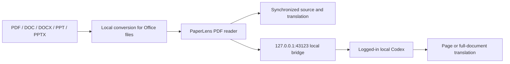

# PaperLens Local

[中文版](./README.md) · [TODO](./TODO.md) · [Apache-2.0 License](./LICENSE)

> A local-first PDF reader that imports common document formats, keeps original and translated paragraphs synchronized, and connects directly to your local Codex for accurate full-document translation.

PaperLens is built for papers, lecture notes, and other PDF learning materials. Files are read locally, source and translation paragraphs stay aligned, and translation requests go directly to the installed Codex CLI.

## Demo video

<video src="https://github.com/user-attachments/assets/58a690bb-1713-4989-953f-b0f5932e93bd" controls muted playsinline width="100%"></video>
## Core features

- **Common-format import:** Import PDF, DOC, DOCX, PPT, and PPTX files. Office files are converted to PDF locally through LibreOffice.
- **Bidirectional paragraph sync:** Hover, focus, or click a paragraph on either side to locate the corresponding paragraph on the other side.
- **Full-document translation:** Translate the document from the current page, save progress page by page, and continue unfinished pages later.
- **Local Codex:** Use the logged-in local Codex CLI by default, with the available model and optional `paper-reader` Skill for more accurate translation and less setup.

## Usage flow

1. Import documents in “我的空间”, organize them into folders, and resume from recent reading.

   

2. Open a document, read the original on the left, view the synchronized translation on the right, and ask questions in AI Chat at the bottom.

   

3. Adjust zoom as you read; formulas and paragraphs stay aligned between the original and translation.

   

## How it works



PDFs are read in the browser. Office files are converted locally. The AI bridge listens only on `127.0.0.1`, and document content is sent to local Codex only when you request a translation.

## Requirements

- macOS; Windows 11 x64 supports development startup and builds within the scope described below
- Node.js `>= 22.13.0`
- npm
- A logged-in [Codex CLI](https://developers.openai.com/codex/cli/) for local AI features
- LibreOffice only if you need DOC/DOCX/PPT/PPTX import
- Optional: the global `paper-reader` Skill

## Install and run

```bash
git clone https://github.com/Peter-cuhk/PaperLens.git
cd PaperLens
npm install
cp .env.example .env
npm run dev
```

Open <http://localhost:3000>.

`npm run dev` starts:

| Service | Address | Purpose |
| --- | --- | --- |
| PaperLens Web | `http://localhost:3000` | PDF reader interface |
| AI bridge | `http://127.0.0.1:43123` | Local Codex translation calls |
| iPad USB gateway | Detects `169.254.*.*` automatically | Optional direct access |

### Windows (PowerShell)

Install Node.js `>= 22.13.0` and Git, then run in PowerShell:

```powershell
git clone https://github.com/Peter-cuhk/PaperLens.git
cd PaperLens
npm ci
if (-not (Test-Path .env)) { Copy-Item .env.example .env }
npm run dev
```

Open <http://localhost:3000> and check the bridge from a second PowerShell window:

```powershell
Invoke-RestMethod http://127.0.0.1:43123/health
```

`ok: true` and `service: "PaperLens AI bridge"` confirm that the bridge is running. Windows support currently covers development startup, builds, Web startup, and the Office conversion described below. Codex discovery/invocation and iPad USB access still need separate adaptation and validation. Thus `providers.local-codex.available: false` or `USB: waiting…` does not indicate a Web startup failure. Startup checks do not require an AI login.

Press `Ctrl+C` in the service terminal to stop the services started by that command. Forward development options after `--`, for example `npm run dev -- --port 3001`. Project paths may contain spaces or Chinese characters.

Build and preview the production Web app:

```powershell
npm run build
npm run start -- --hostname localhost
```

`start` runs only the built Web service, without the AI bridge or USB gateway. Use `npm run dev` for the local reading development workflow.

If PowerShell refuses to load `npm.ps1`, use `npm.cmd` in place of `npm` in these commands; no execution-policy change is needed.

#### Word/PPT conversion on Windows

Install the Windows version from the [LibreOffice website](https://www.libreoffice.org/download/), then restart PaperLens. PDF reading does not require LibreOffice. The bridge searches `PATH` first, followed by `LibreOffice\program` under `ProgramW6432`, `ProgramFiles`, and `ProgramFiles(x86)`. Within each directory it prefers `soffice.com`, then `soffice.exe`. The [LibreOffice command-line guide](https://help.libreoffice.org/latest/en-US/text/shared/guide/start_parameters.html) recommends `soffice.com` for Windows console tasks.

For a custom installation, set the full path in the project's `.env` (spaces, Chinese characters, and backslashes are supported):

```dotenv
PAPERLENS_SOFFICE_PATH="D:\应用程序\LibreOffice\program\soffice.com"
```

Alternatively, set it for the current PowerShell session:

```powershell
$env:PAPERLENS_SOFFICE_PATH = 'C:\Program Files\LibreOffice\program\soffice.com'
& $env:PAPERLENS_SOFFICE_PATH --version
npm run dev
```

An explicit path takes priority. A missing or misspelled path does not silently fall back to another installation. Restart the bridge after changing its configuration, then check:

```powershell
(Invoke-RestMethod http://127.0.0.1:43123/health).documentConversion
```

`available: true` means the converter was found; `engine: "LibreOffice"` identifies the engine. Each conversion runs in the background with its own temporary directory and LibreOffice user profile. A timeout (120 seconds by default), disconnected request, or graceful bridge shutdown stops that conversion's process tree and waits for exit before removing temporary files. Existing LibreOffice windows use other profiles and are not stopped by executable name.

The repository's DOCX/PPTX and legacy DOC/PPT samples were validated on Windows 11 x64, Node.js 24, and LibreOffice 26.8.0.3: English/Chinese text, tables, two-page documents/slides, and paths containing spaces and Chinese characters. Complex layouts, embedded objects, macros, and encrypted documents need validation with the actual material. Rendering also depends on LibreOffice and installed fonts.

### macOS first-run check

```bash
node --version       # >= 22.13.0
npm --version
codex login status   # should report that you are logged in
cp .env.example .env # first run only
npm run dev
curl http://127.0.0.1:43123/health
```

The health response should contain `defaultProvider: "local-codex"` and `providers.local-codex.available: true`. The web app should show `本机 Codex · <model>` in the top-right badge.

To start only the bridge:

```bash
npm run bridge
```

### Startup compatibility checks

```bash
npm run test:startup
npm run test:office
npm run build
npm run test:startup-smoke
npm run typecheck
npm run lint
```

`test:startup` uses isolated fixture services to check arguments, paths with spaces/Chinese characters, failures, and process cleanup. After a build, `test:startup-smoke` starts the actual development/production Web services, checks the reader and bridge, then stops them. Neither command requests AI inference or document conversion.

`test:office` uses fixture processes to check discovery, failed output, timeouts/cancellation, temporary-file cleanup, and the bridge concurrency limit. It does not require LibreOffice. With LibreOffice installed, run `npm run test:office-smoke` to convert all four Office sample formats and check page counts and English/Chinese text using PDF.js. This command fails if LibreOffice is missing and is not part of default CI. See [tests/fixtures/office/README.md](tests/fixtures/office/README.md) for the samples.

GitHub Actions runs these checks on Windows and macOS with Node.js 22 and 24, checking out the project into a path containing spaces and Chinese characters. The full suite remains `npm test`; its existing mock Codex CLI uses a Unix shebang, and a source-level reader test reads a personal `paper-reader/SKILL.md`. Those prerequisites can still fail on a clean Windows machine and are outside the passing startup checks in this change.

## Usage

1. Click “导入学习资料” in “我的空间”, or drag a file into the page.
2. Choose a page; the original appears on the left and the translation on the right.
3. Click “翻译全文” to let local Codex translate the complete document page by page.
4. Hover, focus, or click a paragraph on either side to synchronize the corresponding paragraph.

The current default is local Codex. The planned ChatGPT route is tracked in [TODO](./TODO.md); this README does not expand the experimental web-answer path.

The project name is consistently `PaperLens`; related follow-up items are tracked in [TODO](./TODO.md).

## TODO

- [ ] Route the AI path through the ChatGPT web app in the future.
- [ ] Launch the official website and later offer usage-based API billing.
