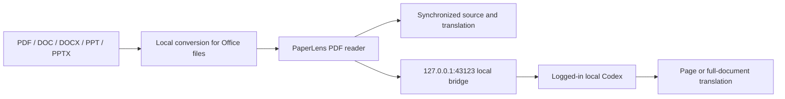

# PaperLens Local

[中文版](./README.md) · [TODO](./TODO.md) · [Apache-2.0 License](./LICENSE)

> A local-first PDF reader that imports common document formats, keeps original and translated paragraphs synchronized, and connects directly to your local Codex for accurate full-document translation.

PaperLens is built for papers, lecture notes, and other PDF learning materials. Files are read locally, source and translation paragraphs stay aligned, and translation requests go directly to the installed Codex CLI.

## Demo video

<video src="https://github.com/user-attachments/assets/58a690bb-1713-4989-953f-b0f5932e93bd" controls muted playsinline width="100%"></video>
## Core features

- **Common-format import:** Import PDF, DOC, DOCX, PPT, and PPTX files. Office files are converted to PDF locally through LibreOffice.
- **Bidirectional paragraph sync:** Hover, focus, or click a paragraph on either side to locate the corresponding paragraph on the other side.
- **Full-document translation:** Translate the document from the current page, save progress page by page, and continue unfinished pages later.
- **Local Codex:** Use the logged-in local Codex CLI by default, with the available model and optional `paper-reader` Skill for more accurate translation and less setup.

## Usage flow

1. Import documents in “我的空间”, organize them into folders, and resume from recent reading.

   

2. Open a document, read the original on the left, view the synchronized translation on the right, and ask questions in AI Chat at the bottom.

   

3. Adjust zoom as you read; formulas and paragraphs stay aligned between the original and translation.

   

## How it works



PDFs are read in the browser. Office files are converted locally. The AI bridge listens only on `127.0.0.1`, and document content is sent to local Codex only when you request a translation.

## Requirements

- macOS; Windows 11 x64 supports development startup, builds, and local Codex within the scope described below
- Node.js `>= 22.13.0`
- npm
- A logged-in [Codex CLI](https://developers.openai.com/codex/cli/) for local AI features
- LibreOffice only if you need DOC/DOCX/PPT/PPTX import
- Optional: the global `paper-reader` Skill

## Install and run

```bash
git clone https://github.com/Peter-cuhk/PaperLens.git
cd PaperLens
npm install
cp .env.example .env
npm run dev
```

Open <http://localhost:3000>.

`npm run dev` starts:

| Service | Address | Purpose |
| --- | --- | --- |
| PaperLens Web | `http://localhost:3000` | PDF reader interface |
| AI bridge | `http://127.0.0.1:43123` | Local Codex translation calls |
| iPad USB gateway | Detects `169.254.*.*` automatically | Optional direct access |

### Windows (PowerShell)

Install Node.js `>= 22.13.0` and Git, then run in PowerShell:

```powershell
git clone https://github.com/Peter-cuhk/PaperLens.git
cd PaperLens
npm ci
if (-not (Test-Path .env)) { Copy-Item .env.example .env }
npm run dev
```

Open <http://localhost:3000> and check the bridge from a second PowerShell window:

```powershell
Invoke-RestMethod http://127.0.0.1:43123/health
```

`ok: true` and `service: "PaperLens AI bridge"` confirm that the bridge is running. Windows support covers development startup, builds, Web startup, and local Codex as described below. Office conversion and iPad USB access still need separate adaptation and validation. `providers.local-codex.available: false` or `USB: waiting…` does not indicate a Web startup failure. Startup checks do not require an AI login.

Press `Ctrl+C` in the service terminal to stop the services started by that command. Forward development options after `--`, for example `npm run dev -- --port 3001`. Project paths may contain spaces or Chinese characters.

Build and preview the production Web app:

```powershell
npm run build
npm run start -- --hostname localhost
```

`start` runs only the built Web service, without the AI bridge or USB gateway. Use `npm run dev` for the local reading development workflow.

If PowerShell refuses to load `npm.ps1`, use `npm.cmd` in place of `npm` in these commands; no execution-policy change is needed.

### Local Codex on Windows

After installing Codex CLI, check its version and login status in a terminal. For an npm installation, these commands avoid PowerShell's `.ps1` execution policy:

```powershell
codex.cmd --version
codex.cmd login status
# If signed out, run codex.cmd login
```

PaperLens uses `PAPERLENS_CODEX_PATH` first, otherwise searches PATH. On Windows it supports `codex.exe` and the standard npm `codex.cmd` / `codex.ps1` shims. npm shims resolve to `@openai/codex/bin/codex.js`, which runs through the current Node executable. Prompts use stdin; arguments and image paths remain separate, including spaces and Chinese characters. macOS keeps PATH, the ChatGPT application CLI, and Homebrew discovery.

If the CLI is outside PATH, set an absolute path in the same PowerShell terminal before starting PaperLens, or fill in `PAPERLENS_CODEX_PATH` in `.env`:

```powershell
$env:PAPERLENS_CODEX_PATH = 'C:\Tools\Codex\codex.exe'
npm run dev
```

The override also accepts a standard npm `codex.cmd` or Codex's JavaScript entry. An invalid explicit path produces an error. For custom `.cmd` / `.bat` / `.ps1` wrappers, specify the underlying executable or JavaScript entry instead. After changing PATH or environment variables, open a new terminal and restart PaperLens.

```powershell
(Invoke-RestMethod http://127.0.0.1:43123/health).providers.'local-codex'
```

`installed` means the CLI passed its version check; `loggedIn` means `codex login status` succeeded; `available` requires both. Health checks cache results for up to 10 seconds. “Test connection” and local AI requests recheck the status, so signing in does not require a service restart. `error` / `code` distinguish a missing path, startup failure, and a signed-out CLI. Login checks do not validate server-side quota or model access; inference can still fail. PaperLens reuses CLI authentication (respecting `CODEX_HOME`), without reading or copying credential contents or signing in on your behalf.

Translation, terms, and ordinary chat keep `--ignore-user-config`; repository verification keeps the existing search/config behavior. All modes retain `read-only` and `--ephemeral`. The `paper-reader` Skill is optional: a missing file does not prevent bridge startup or fixture tests. Cancellation and timeouts stop this CLI and its descendants, wait for exit, then remove temporary image files.

### macOS first-run check

```bash
node --version       # >= 22.13.0
npm --version
codex login status   # should report that you are logged in
cp .env.example .env # first run only
npm run dev
curl http://127.0.0.1:43123/health
```

The health response should contain `defaultProvider: "local-codex"` and `providers.local-codex.available: true`. The web app should show `本机 Codex · <model>` in the top-right badge.

To start only the bridge:

```bash
npm run bridge
```

### Compatibility checks

```bash
npm test
npm run typecheck
npm run lint
```

`npm test` builds and runs the full suite, including startup, Codex discovery, login state, arguments/images, errors, and process cleanup. Codex tests use an isolated JavaScript fixture CLI. They require neither a personal Skill nor a logged-in AI account and do not request AI inference. Real translation and chat require separate acceptance checks.

GitHub Actions runs these checks on Windows and macOS with Node.js 22 and 24, checking out the project into a path containing spaces and Chinese characters. You can still run `npm run test:startup` on its own. After a build, `npm run test:startup-smoke` starts the actual development/production Web services, checks the reader and bridge, then stops them.

## Usage

1. Click “导入学习资料” in “我的空间”, or drag a file into the page.
2. Choose a page; the original appears on the left and the translation on the right.
3. Click “翻译全文” to let local Codex translate the complete document page by page.
4. Hover, focus, or click a paragraph on either side to synchronize the corresponding paragraph.

The current default is local Codex. The planned ChatGPT route is tracked in [TODO](./TODO.md); this README does not expand the experimental web-answer path.

The project name is consistently `PaperLens`; related follow-up items are tracked in [TODO](./TODO.md).

## TODO

- [ ] Route the AI path through the ChatGPT web app in the future.
- [ ] Launch the official website and later offer usage-based API billing.
