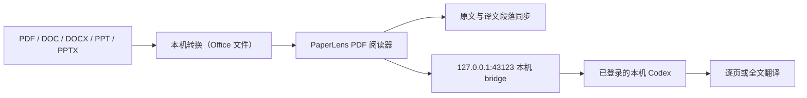

# PaperLens Local

[English](./README.en.md) · [TODO](./TODO.md) · [Apache-2.0 License](./LICENSE)

> 一个本地优先的 PDF 阅读器：导入资料、同步原文与译文，并直接连接本机 Codex 完成更准确的全文翻译。

PaperLens 面向论文、课程讲义和其他 PDF 学习资料。文件在本机读取，原文与译文保持段落对应，翻译请求直接交给本机 Codex。

## 演示视频

<video src="https://github.com/user-attachments/assets/58a690bb-1713-4989-953f-b0f5932e93bd" controls muted playsinline width="100%"></video>
## 核心功能

- **多格式导入**：支持 PDF、DOC、DOCX、PPT 和 PPTX；Office 文件通过本机 LibreOffice 临时转换为 PDF。
- **段落双向同步**：悬停、聚焦或点击原文/译文段落，都可以定位另一侧的对应内容。
- **全文翻译**：一键从当前页开始翻译全文，逐页保存进度，之后可以继续未完成的页面。
- **本机 Codex**：默认直接调用已登录的本机 Codex，翻译使用可用模型和 `paper-reader` Skill，减少额外配置并提升翻译准确度。

## 使用流程

1. 在“我的空间”导入资料，按文件夹整理，并从最近阅读继续。

   

2. 打开资料，左侧阅读原文，右侧查看同步译文，在底部 AI Chat 直接提问。

   

3. 调整缩放继续阅读，公式和段落在原文与译文之间保持对应。

   

## 工作方式



PDF 由浏览器本地读取；Office 文件只在本机转换。AI bridge 仅监听 `127.0.0.1`，主动翻译时才会把资料内容交给本机 Codex。

## 环境要求

- macOS；Windows 11 64 位支持开发启动、构建和本机 Codex，功能范围见下方 Windows 说明
- Node.js `>= 22.13.0`
- npm
- 使用本机 AI 功能时，需要安装并登录 [Codex CLI](https://developers.openai.com/codex/cli/)
- 需要导入 DOC/DOCX/PPT/PPTX 时，再安装 LibreOffice
- 可选：全局安装 `paper-reader` Skill

## 安装与启动

```bash
git clone https://github.com/Peter-cuhk/PaperLens.git
cd PaperLens
npm install
cp .env.example .env
npm run dev
```

打开 <http://localhost:3000>。

`npm run dev` 会启动：

| 服务 | 地址 | 用途 |
| --- | --- | --- |
| PaperLens Web | `http://localhost:3000` | PDF 阅读器界面 |
| AI bridge | `http://127.0.0.1:43123` | 本机 Codex 翻译调用 |
| iPad USB gateway | 自动检测 `169.254.*.*` | 可选的直连访问 |

### Windows（PowerShell）

安装 Node.js `>= 22.13.0` 和 Git 后，在 PowerShell 中运行：

```powershell
git clone https://github.com/Peter-cuhk/PaperLens.git
cd PaperLens
npm ci
if (-not (Test-Path .env)) { Copy-Item .env.example .env }
npm run dev
```

打开 <http://localhost:3000>，在另一个 PowerShell 窗口检查 bridge：

```powershell
Invoke-RestMethod http://127.0.0.1:43123/health
```

`ok: true` 和 `service: "PaperLens AI bridge"` 表示 bridge 已启动。Windows 适配覆盖开发启动、构建、Web 启动及下述本机 Codex 接入和 Office 转换；iPad USB 连接仍待单独适配和验证。`providers.local-codex.available: false` 或 `USB: waiting…` 不代表网页启动失败，启动检查也不需要登录 AI 账户。

在运行服务的窗口按 `Ctrl+C` 停止本次启动的服务。开发参数通过 `--` 转发，例如 `npm run dev -- --port 3001`。项目目录可以包含空格或中文。

构建并查看生产 Web 页面：

```powershell
npm run build
npm run start -- --hostname localhost
```

`start` 只启动构建后的 Web 服务，不会启动 AI bridge 或 USB gateway。日常本机阅读开发流程使用 `npm run dev`。

如果 PowerShell 提示无法加载 `npm.ps1`，可在上述命令中把 `npm` 换成 `npm.cmd`，无需修改系统执行策略。

### Windows 本机 Codex

安装 Codex CLI 后，先在终端确认版本和登录状态。npm 安装可使用以下命令，避免 PowerShell 的 `.ps1` 执行策略影响检查：

```powershell
codex.cmd --version
codex.cmd login status
# 如果尚未登录，再运行 codex.cmd login
```

PaperLens 优先使用 `PAPERLENS_CODEX_PATH`，否则搜索 PATH。Windows 支持 PATH 中的 `codex.exe` 和标准 npm 安装的 `codex.cmd` / `codex.ps1`；npm 包装入口会解析到 `@openai/codex/bin/codex.js`，再通过当前 Node 执行。提示词经标准输入发送，参数和图片路径独立传递，支持空格和中文路径。macOS 保留 PATH、ChatGPT 应用内 CLI 和 Homebrew 路径探测。

若 CLI 不在 PATH 中，可在启动 PaperLens 的同一个 PowerShell 窗口指定绝对路径，或填写 `.env` 中的 `PAPERLENS_CODEX_PATH`：

```powershell
$env:PAPERLENS_CODEX_PATH = 'C:\Tools\Codex\codex.exe'
npm run dev
```

也可指定标准 npm 的 `codex.cmd` 或 Codex 的 JavaScript 入口。显式路径无效时会报告错误；自定义 `.cmd` / `.bat` / `.ps1` 包装脚本需要改为指定实际可执行文件或 JavaScript 入口。修改 PATH 或环境变量后，重新打开终端并重启 PaperLens。

```powershell
(Invoke-RestMethod http://127.0.0.1:43123/health).providers.'local-codex'
```

`installed` 表示 CLI 通过版本检查，`loggedIn` 表示 `codex login status` 成功，`available` 需要两者均为真。健康检查最多缓存 10 秒；“测试连接”和本机 AI 请求会重新检查，因此登录后无需重启服务。`error` / `code` 会区分路径缺失、启动失败和未登录。登录检查不验证服务端额度或模型可用性，实际请求仍可能失败。PaperLens 复用 CLI 登录状态（遵循 `CODEX_HOME`），不会读取或复制凭据内容，也不会代为登录。

翻译、术语和普通问答沿用 `--ignore-user-config`；仓库核实保留原来的搜索与配置行为。所有模式继续使用 `read-only` 和 `--ephemeral`。`paper-reader` Skill 可选；缺少该文件不会阻止 bridge 启动或模拟 CLI 测试。取消或超时会停止本次 CLI 及其子进程，等待退出后再清理图片临时文件。

### Windows Word/PPT 转换

从 [LibreOffice 官网](https://www.libreoffice.org/download/)安装 Windows 版本后重启 PaperLens。只阅读 PDF 时无需安装 LibreOffice。bridge 会先搜索 `PATH`，再检查 `ProgramW6432`、`ProgramFiles` 和 `ProgramFiles(x86)` 下的 `LibreOffice\program`，同一目录优先使用 `soffice.com`，其次为 `soffice.exe`。[LibreOffice 命令行说明](https://help.libreoffice.org/latest/en-US/text/shared/guide/start_parameters.html)建议 Windows 命令行任务使用 `soffice.com`。

使用其他安装目录时，可以在项目的 `.env` 中设置完整路径（支持空格、中文和反斜杠）：

```dotenv
PAPERLENS_SOFFICE_PATH="D:\应用程序\LibreOffice\program\soffice.com"
```

也可以只为当前 PowerShell 窗口设置：

```powershell
$env:PAPERLENS_SOFFICE_PATH = 'C:\Program Files\LibreOffice\program\soffice.com'
& $env:PAPERLENS_SOFFICE_PATH --version
npm run dev
```

显式路径优先；如果路径拼错或文件不存在，不会自动改用另一份安装。修改配置后重启 bridge，再检查：

```powershell
(Invoke-RestMethod http://127.0.0.1:43123/health).documentConversion
```

`available: true` 表示找到转换程序，`engine: "LibreOffice"` 表示所用引擎。导入 Office 文件时会在后台转换，并为每次任务创建独立临时目录和 LibreOffice 用户配置。转换超时（默认 120 秒）、请求断开或 bridge 正常退出时，会停止本次转换的进程树，等待进程退出后再清理临时文件。已有 LibreOffice 窗口使用其他配置，不会按程序名统一关闭。

Windows 11 x64、Node.js 24、LibreOffice 26.8.0.3 已验证仓库内的 DOCX/PPTX 及旧版 DOC/PPT 样例：中文与英文文字、表格、两页文档／幻灯片、含空格和中文的路径。复杂排版、嵌入对象、宏和加密文档仍需按实际资料验证；转换效果取决于 LibreOffice 与本机字体。

### macOS 首次启动检查

```bash
node --version       # >= 22.13.0
npm --version
codex login status   # 应显示已登录
cp .env.example .env # 只需首次执行
npm run dev
curl http://127.0.0.1:43123/health
```

健康检查中应看到 `defaultProvider: "local-codex"` 和 `providers.local-codex.available: true`。网页右上角应显示“本机 Codex · <模型名>”。

如只需要启动 bridge：

```bash
npm run bridge
```

### 兼容性检查

```bash
npm test
npm run typecheck
npm run lint
```

`npm test` 先构建再运行完整测试，包括 Office 模拟转换、启动检查、Codex 发现、登录状态、参数与图片传递、错误处理和进程清理。Codex 测试使用独立 JavaScript 模拟 CLI，不要求个人 Skill 或已登录的 AI 账户，也不会发起 AI 推理。真实翻译与问答需要单独验收。

`test:office` 使用模拟转换进程，覆盖查找路径、错误输出、超时／取消、临时文件清理和 bridge 并发限制，无需安装 LibreOffice。安装真实 LibreOffice 后，可运行 `npm run test:office-smoke`，转换仓库内四种 Office 格式的样例，并用 PDF.js 检查页数、英文及中文文字；此命令在未检测到 LibreOffice 时会失败，不包含在默认 CI 中。样例说明见 [tests/fixtures/office/README.md](tests/fixtures/office/README.md)。

GitHub Actions 在 Windows 和 macOS、Node.js 22 和 24 上执行上述检查，并将仓库放在带空格和中文的目录中。仍可单独运行 `npm run test:startup`；构建后运行 `npm run test:startup-smoke` 会启动真实开发／生产 Web 服务、检查页面和 bridge，再停止服务。

## 使用方式

1. 在“我的空间”点击“导入学习资料”，或把文件拖入页面。
2. 在阅读区选择页面；左侧显示原文，右侧显示译文。
3. 点击“翻译全文”，让本机 Codex 按页完成整份资料翻译。
4. 悬停、聚焦或点击任一侧段落，另一侧会同步定位对应段落。

当前默认使用本机 Codex；未来改用 ChatGPT 的计划记录在 [TODO](./TODO.md)，本 README 不展开实验性网页回答通道。

项目名称统一为 `PaperLens`；相关后续事项记录在 [TODO](./TODO.md) 中。

## 待办事项

- [ ] 未来将 AI 路径接入 ChatGPT 网页端。
- [ ] 发布并上线官网，未来支持 API 按使用量计费（用多少付多少）。
