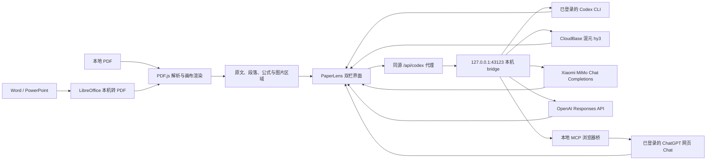

# PaperLens Local

> 面向论文、课程 PPT、讲义和阅读材料的本地优先阅读与理解工作台：保留原文排版，同步翻译、提问、批注与笔记。


PaperLens 希望把“阅读原文、查看译文、理解概念、引用图表、继续追问、沉淀笔记”放在同一个界面里。无论是研究论文、学校课程 PPT、老师讲义还是课外阅读材料，都进入同一套本地优先的阅读流程。PDF 在浏览器中解析与渲染；Word/PPT 先通过本机 bridge 调用 LibreOffice 临时转为 PDF，然后复用同一套阅读、翻译和批注能力。

## 核心能力

- **双栏资料阅读**：PDF 原文与中文译文并排展示，主页面和缩略图按 Retina/DPR 清晰渲染，支持连续跨页滚动和 60%–250% 缩放。
- **Word / PowerPoint 导入**：支持 DOC、DOCX、PPT 和 PPTX；文件只在本机临时转 PDF，转换后进入现有阅读链路。
- **段落双向同步**：悬停、聚焦或点击任一侧段落，都能定位另一侧对应内容。
- **按页或全文翻译**：既可即时翻译当前页，也可一键翻译全文；批量任务优先处理当前页、自动跳过已完成页面，并逐页保存进度。
- **精确上下文选择**：单击引用整段，拖选则只引用实际选中的文字和行。
- **公式渲染与解释**：译文和 AI Chat 均使用 KaTeX；无法可靠恢复的 PDF 公式会提示以左侧原文为准，不猜测残缺公式。
- **图片与图表上下文**：自动检测带 Figure/Fig. 图注的图片区域，点击即可截取整图加入 AI Chat；聊天输入框也支持 `Command-V` 粘贴截图。
- **可选 AI Provider**：在界面中切换本机 Codex、实验性 ChatGPT 网页问答、腾讯 CloudBase 混元、Xiaomi MiMo 和 OpenAI，并分别选择翻译/问答模型。
- **资料上下文问答**：当前 Provider 结合页面、选区、图片和最近对话回答，并显示实际路由、模型、耗时与 token 用量。
- **跨资料 `@` 引用**：在 AI Chat 输入 `@` 搜索“我的空间”；明确引用单篇资料时会携带所有可提取文字页与页码，引用文件夹时则在整个文件夹内按问题检索证据。
- **论文仓库核实模式**：当论文或课程材料中检测到代码仓库后，代码实现类问题会要求核实 GitHub、alphaXiv 或实时来源，避免按经验臆测接口。
- **批注与阅读手势**：支持 PDF 文字标亮、橡皮擦，以及保留触控板与触摸惯性的原生连续滚动。
- **iPad 直连**：可选的 USB link-local 网关让 iPad 通过 Mac 访问阅读器，同时保持 Codex bridge 仅监听本机回环地址。

## 工作方式



PaperLens 是 **local-first**，但不是完全离线工具：PDF 由浏览器本地读取；Word/PPT 只传给 `127.0.0.1` 上的本机 bridge，转换临时目录会立即清理。当你主动翻译或提问时，相关页面文字、选区或图片才会交给所选 Provider。

## 环境要求

- macOS（当前开发和 iPad USB 流程的验证环境）
- Node.js `>= 22.13.0`
- npm
- LibreOffice（导入 Word/PowerPoint 时需要；只阅读 PDF 时可选）
- 已安装并登录的 [Codex CLI](https://developers.openai.com/codex/cli/)，或有效的 CloudBase / MiMo / OpenAI API Key
- 推荐安装全局 `paper-reader` Skill，用于约束翻译、解释和仓库核实行为

检查环境：

```bash
node --version
npm --version
codex --version
codex login status
```

## 安装与启动

```bash
git clone https://github.com/Peter-cuhk/PaperLens.git
cd PaperLens
npm install
cp .env.example .env
npm run dev
```

打开 [http://localhost:3000](http://localhost:3000)。

`npm run dev` 会同时启动：

| 服务 | 地址 | 用途 |
| --- | --- | --- |
| PaperLens Web | `http://localhost:3000` | 阅读器界面 |
| AI bridge | `http://127.0.0.1:43123` | Provider 路由、服务端密钥和翻译/问答调用 |
| iPad USB gateway | 自动检测 `169.254.*.*` | 可选的直连访问入口 |

如只需要启动 bridge：

```bash
npm run bridge
```

### 可选 API 配置

编辑不会被 Git 跟踪的 `.env`：

```dotenv
# 腾讯 CloudBase 混元（仅放在服务端）
CLOUDBASE_ENV_ID=
CLOUDBASE_APIKEY=
PAPERLENS_HUNYUAN_PROVIDER=hunyuan-v3
PAPERLENS_HUNYUAN_TRANSLATION_MODEL=hy3
PAPERLENS_HUNYUAN_CHAT_MODEL=hy3

# Xiaomi MiMo（OpenAI 兼容的 Chat Completions 协议）
MIMO_API_KEY=
MIMO_BASE_URL=https://api.xiaomimimo.com/v1
PAPERLENS_MIMO_TRANSLATION_MODEL=mimo-v2.5
PAPERLENS_MIMO_CHAT_MODEL=mimo-v2.5

# OpenAI（Responses API）
OPENAI_API_KEY=
PAPERLENS_OPENAI_TRANSLATION_MODEL=gpt-5.6-terra
PAPERLENS_OPENAI_CHAT_MODEL=gpt-5.6-terra
PAPERLENS_OPENAI_REASONING_EFFORT=low

# 实验性 ChatGPT 网页问答（需要加载 browser-extension/）
PAPERLENS_CHATGPT_WEB_ENABLED=1
PAPERLENS_CHATGPT_WEB_PORT=43124
PAPERLENS_CHATGPT_WEB_TIMEOUT_MS=240000
```

重启 `npm run dev` 后，在右上角“AI 服务设置”中选择 Provider、模型并点击“测试当前服务”。混元暂时不可用、配额用尽或页面含图片时，服务会自动改用 MiMo，而不是只展示报错。代码实现或仓库核实问题在本机 Codex 可用时会回退到 Codex。

### 实验性 ChatGPT 网页问答

这条路线只用于 AI Chat，不用于翻译或术语提取；选择它时，翻译与术语任务仍会交给 MiMo。它由三个本地组件组成：PaperLens bridge 是 MCP Client，`bridge/chatgpt-web-mcp.mjs` 提供 MCP 工具，`browser-extension/` 在用户已经登录的 ChatGPT 网页中发送问题并读取页面可见的最终回答。扩展不读取 Cookie、密码或浏览器存储，也不调用 ChatGPT 私有接口。

首次连接：

```bash
npm run chatgpt-web:setup
```

Chrome 会打开扩展管理页和 `browser-extension/` 文件夹。打开“开发者模式”，点击“加载已解压的扩展程序”，选择该文件夹，然后打开并登录 [chatgpt.com](https://chatgpt.com/)。回到 PaperLens 的“AI 服务设置”，选择“ChatGPT 网页 · 实验”并点击“测试当前服务”。

当前版本是本地实验通道：ChatGPT 页面结构变化、登录确认或验证码都可能要求人工处理。它不会共享账号；每台电脑只使用该用户自己浏览器里的登录会话。

线上登录、余额、计费和 CloudBase 部署由独立的 [PaperLens-Cloud](https://github.com/Peter-cuhk/PaperLens-Cloud) 仓库维护；本仓库不包含线上发布入口。

## 使用指南

### 导入与阅读

1. 在“我的空间”点击“导入学习资料”，或把 PDF、DOC/DOCX、PPT/PPTX 拖入页面。Word/PPT 会先在本机转为 PDF。
2. 使用左侧缩略图或顶部页码切换页面。
3. `100%` 表示适应阅读区宽度；点击百分比可快速恢复。
4. 中间阅读区是一条连续文档流，可直接滑过页底和页间空隙；页码、缩略图和右侧翻译会随视口中心自动同步。

### 翻译与公式

- “翻译本页”适合按需阅读；“翻译全文”会从当前页开始准备全部剩余页面。
- 全文翻译过程中可以继续翻页，也可以随时暂停；再次点击会从本机已保存的进度继续。
- 连续失败时任务会停止并保留已完成译文，配置好 Provider 后可重试未完成页面。

1. 点击右侧“翻译本页”。
2. 译文按 PDF 几何分段，并与原文段落保持映射。
3. 可可靠恢复的公式通过 KaTeX 排版，并附带变量、上下标或求和范围说明。
4. PDF 抽取破坏了公式结构时，界面显示“公式以左侧原文为准”。

### AI Chat

- 默认按页引用当前资料的全部可提取文字，不再只选择当前页和少量相关页；回答必须标注证据页码。
- 对话记录按资料保存在本机 IndexedDB；退出后重新打开同一份资料，会恢复此前的用户问题、AI 回答和路由信息。
- 单击原文段落：引用整段。
- 拖选原文：只引用选区。
- 点击 Figure 悬停框：截取资料中的整张图片及完整图注。
- 在输入框按 `Command-V`：加入剪贴板截图。
- 在输入框键入 `@`：按资料标题、原文件名或仓库别名搜索空间资料；回车选择，最多同时引用 3 份。
- 跨资料回答会区分资料名称并标出证据页码；相关页由本机 PDF 文本检索选出，不会把全部资料无差别加入提示词。
- 每次最多引用 4 张图片；单图上限 10 MB，总上限 24 MB。
- Codex 模式的图片会写入请求级临时目录并在调用后清理；API 模式直接发送经过浏览器压缩的 Base64 图片。

## 安全边界

- AI bridge 只监听 `127.0.0.1`，不会直接暴露到局域网或 iPad。
- bridge 只接受 PaperLens 本地来源；调用 Codex 时使用只读 sandbox。
- ChatGPT 网页 MCP 与扩展通道只监听 `127.0.0.1:43124`；扩展只操作可见的 ChatGPT 输入框和回答，不读取 Cookie、密码或浏览器存储。
- API Key 仅从服务端 `.env` / 环境变量读取；界面只保存 Provider、模型和推理强度，绝不保存密钥。
- 本地粘贴图片仅接受 PNG、JPEG 和 WebP。
- 仓库实现问题要求真实来源证据；来源不可用时应明确停止，而不是补猜实现。
- `.env`、构建缓存、运行输出、临时工作文件和 `node_modules` 已通过 `.gitignore` 排除；仓库只提交无密钥的 `.env.example`。

## 项目结构

```text
app/
  page.tsx                  # 阅读器主界面、PDF 渲染、翻译、聊天与同步
  continuous-scroll.ts     # 连续文档流的当前页判定与渲染窗口
  figure-regions.ts         # 图注驱动的图片区域检测与像素边界修正
  paper-mentions.ts         # 论文标题识别、别名搜索与相关页面排序
  selection-geometry.ts     # PDF 文本选区合并
  github-repository.ts      # 论文仓库 URL 提取
bridge/
  server.mjs                # 回环 AI bridge、提示词、Provider 路由和 Codex 调用
  provider-routing.mjs      # 能力路由与仓库核实回退
  provider-errors.mjs       # 统一错误分类
  providers/cloudbase-hunyuan.mjs # CloudBase Node SDK / 混元 hy3 Adapter
  providers/openai.mjs      # OpenAI Responses API Adapter
  providers/mimo.mjs        # Xiaomi MiMo Chat Completions Adapter
  providers/chatgpt-web.mjs # MCP Client / ChatGPT 网页实验 Adapter
  chatgpt-web-mcp.mjs       # 本地 MCP Server 与扩展 WebSocket 通道
browser-extension/          # 在可见 ChatGPT 网页中发送并提取回答
scripts/
  dev.mjs                   # 同时启动 Web、bridge 与 USB gateway
  usb-gateway.mjs           # iPad USB link-local 转发
tests/                      # 图框、选区、连续滚动、仓库和页面契约测试
public/
  pdf.worker.min.mjs        # 与当前 PDF.js 版本匹配的 worker
worker/                     # Web/API worker 入口
design-qa.md                # 实现与浏览器验收记录
```

## 开发与验证

```bash
npm run lint
npm run typecheck
npm test
```

`npm test` 会先执行生产构建，再运行 Node 测试。当前回归覆盖：

- PDF 图框与多行图注边界
- 跨行文字选区合并
- 连续滚动的当前页判定与相邻页渲染窗口
- GitHub 仓库地址提取
- CloudBase 混元 / OpenAI / MiMo Provider 的本地 Mock 协议与错误重试
- API 与本机 Codex 的能力路由和仓库核实回退
- 页面、KaTeX、AI bridge、iPad gateway 和图片上下文的源码契约

## 常见问题

### 页面显示“AI 服务未连接”

确认 `codex` 已安装并登录，或对应 API Key 已写入 `.env`，然后检查 bridge：

```bash
curl http://127.0.0.1:43123/health
```

### 端口被占用

```bash
lsof -nP -iTCP:3000 -sTCP:LISTEN
lsof -nP -iTCP:43123 -sTCP:LISTEN
```

关闭旧的 PaperLens 进程后重新运行 `npm run dev`。

### 公式没有正确恢复

PDF 的视觉公式经常被拆成多个无结构文本片段。PaperLens 只对能够无歧义恢复的内容生成 LaTeX；其余情况保留左侧 PDF 作为权威来源。

## 当前状态

PaperLens 目前定位为本地优先的学习资料阅读与理解工作台，覆盖论文、课程 PPT、讲义和阅读材料；重点是实用性和可验证行为，而不是通用云端文件管理。实现与浏览器验收细节记录在 [`design-qa.md`](./design-qa.md)。
